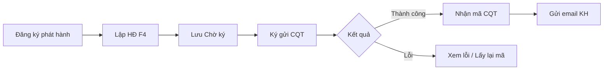
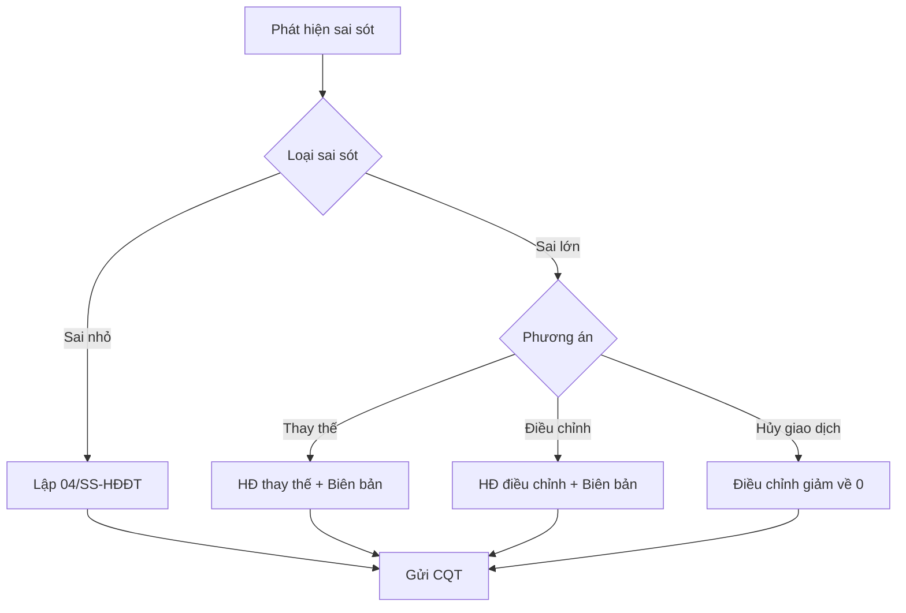

# DOC-03 — BRD: Nền tảng Hóa đơn điện tử (HDDT)

| Version | Date | Author | Status |
|---------|------|--------|--------|
| 0.3 | 2026-10-02 | BA | Draft |

> **Phạm vi:** Business Requirements Document cho nền tảng HĐĐT — không gắn thương hiệu/vendor cụ thể.  
> **Nguồn discovery:** Khảo sát UI hệ thống tham chiếu và quy định pháp luật HĐĐT Việt Nam (01–02/10/2026).

---

## 1. Tóm tắt điều hành

Nền tảng SaaS hóa đơn điện tử tuân thủ NĐ 123/2020, NĐ 70/2025, TT 78/2021, TT 88/2021, TT 32/2025.

Hệ thống cho phép doanh nghiệp, hộ kinh doanh và tổ chức:

- Đăng ký phát hành hóa đơn với CQT
- Lập, ký số, phát hành hóa đơn GTGT (có mã / không mã CQT)
- Xử lý sai sót (thông báo 04/SS, thay thế, điều chỉnh)
- Truyền nhận dữ liệu CQT, lập bảng tổng hợp
- Quản lý danh mục, báo cáo, người dùng và tích hợp thiết bị (POS, máy tính tiền)

**Môi trường tham chiếu:** Tenant demo truy cập qua `#/register` (không yêu cầu đăng nhập); môi trường production yêu cầu đăng nhập MST + tên đăng nhập + mật khẩu.

---

## 2. Mục tiêu kinh doanh

| ID | Mục tiêu | Chỉ số thành công (ước lượng) |
|----|----------|-------------------------------|
| OBJ-01 | Tuân thủ pháp luật HĐĐT | 100% HĐ phát hành đúng mẫu, đúng quy trình CQT |
| OBJ-02 | Giảm chi phí vận hành | Giảm chi phí in ấn, vận chuyển, lưu kho so với HĐ giấy |
| OBJ-03 | Tăng hiệu suất xuất HĐ | Lập HĐ < 5 phút; ký gửi CQT hàng loạt; sao chép HĐ |
| OBJ-04 | Minh bạch với CQT | Truyền dữ liệu real-time; lịch sử truyền nhận đầy đủ |
| OBJ-05 | Hỗ trợ đa ngành | Bán lẻ, dịch vụ, doanh nghiệp lớn volume cao |

---

## 3. Stakeholder

| Vai trò | Mô tả | Nhu cầu chính |
|---------|-------|---------------|
| Chủ DN / Hộ KD | Quyết định triển khai | Tuân thủ, chi phí, dễ dùng |
| Kế toán / Thuế | Lập HĐ, kê khai | Đúng quy định, báo cáo, đối soát CQT |
| Nhân viên bán hàng | Xuất HĐ tại quầy | Thao tác nhanh, ít lỗi |
| Quản trị hệ thống | Cấu hình DN, user, quyền | Phân quyền, chứng thư số, email |
| CQT | Nhận dữ liệu HĐ | XML chuẩn, tờ khai, bảng tổng hợp |
| Khách hàng cuối | Nhận HĐ | Email PDF, tra cứu online |
| Bộ phận hỗ trợ | Hỗ trợ 24/7 | Chat trực tiếp, hotline kỹ thuật |

---

## 4. Phạm vi sản phẩm

### 4.1 In scope (năng lực sản phẩm)

| Module ID | Tên module | Mô tả ngắn |
|-----------|------------|------------|
| AUTH | Xác thực & truy cập | Đăng nhập, đăng ký, quên MK, đa ngôn ngữ |
| REG | Đăng ký phát hành | Mẫu HĐ, tờ khai NĐ123, tờ khai NĐ70 |
| INV | Hóa đơn đầu ra | Lập, ký, gửi CQT, email, chiết khấu |
| ERR | Xử lý sai sót | 04/SS, thay thế, điều chỉnh, hủy, bảng kê |
| TXN | Lịch sử truyền nhận | Tờ khai, HĐ, 04/SS, bảng tổng hợp, QR |
| RPT | Báo cáo | THSD HĐ, chi tiết, PMKT, PL101 |
| CAT | Danh mục | KH, HH/DV, UOM, tiền tệ, email |
| SYS | Hệ thống | DN, user, quyền, chứng thư số, cấu hình |
| SUP | Hỗ trợ | Chat, hướng dẫn, tải xuống, thông báo |

### 4.2 Out of scope (sản phẩm nền — extension riêng)

- Tích hợp PSS/GDS, REVERA, CRA (dự án khách hàng lớn — extension riêng)
- Phần mềm kế toán đầy đủ, kê khai BHXH (module/extension riêng)
- Giải pháp thanh toán, thông báo số dư (sản phẩm tích hợp riêng)
- Module ngành xăng dầu (trạm, vòi bơm, giao dịch bơm, báo cáo mẫu thuế xăng dầu)
- Thay thế ERP/kế toán của khách hàng

---

## 5. Yêu cầu chức năng theo module

### 5.1 AUTH — Xác thực & cổng truy cập

**Route khảo sát:** `#/login`, `#/register`, `#/forgot-password`

| ID | Yêu cầu | Mô tả | Ưu tiên |
|----|---------|-------|---------|
| AUTH-FR-01 | Đăng nhập | MST + tên đăng nhập + mật khẩu; ghi nhớ đăng nhập | Must |
| AUTH-FR-02 | Đăng ký tài khoản | Link đăng ký từ màn hình login | Must |
| AUTH-FR-03 | Quên mật khẩu | Nhập MST + email; hỗ trợ USB Token (bước xác thực) | Must |
| AUTH-FR-04 | Đa ngôn ngữ | Chọn ngôn ngữ (VI) | Should |
| AUTH-FR-05 | Khuyến mãi / lead | Popup marketing / đăng ký ưu đãi (tùy cấu hình) | Could |
| AUTH-FR-06 | Hỗ trợ chat | Widget chat "Hỗ trợ" góc phải | Must |

**Quy tắc nghiệp vụ:**

- BR-AUTH-01: Nút Đăng nhập disabled khi thiếu trường bắt buộc
- BR-AUTH-02: Quên MK yêu cầu MST và email hợp lệ

---

### 5.2 REG — Đăng ký phát hành

**Menu:** Đăng ký phát hành

| ID | Yêu cầu | Mô tả | Ưu tiên |
|----|---------|-------|---------|
| REG-FR-01 | Mẫu hóa đơn | Khai báo/quản lý mẫu HĐ theo quy định TCT | Must |
| REG-FR-02 | Tờ khai NĐ123/2020 | Lập, ký, gửi tờ khai đăng ký/thay đổi theo NĐ 123 | Must |
| REG-FR-03 | Tờ khai NĐ70/2025 | Lập tờ khai theo NĐ 70/2025, NĐ 254/2026 | Must |

---

### 5.3 INV — Hóa đơn đầu ra

**Route:** `#/hoa-don`

| ID | Yêu cầu | Mô tả | Ưu tiên |
|----|---------|-------|---------|
| INV-FR-01 | Danh sách HĐ | Lọc theo loại (Gốc/Chiết khấu), trạng thái CQT, MST NM, ngày, số tiền | Must |
| INV-FR-02 | Tạo mới (F4) | Lập HĐ mới: ký hiệu, ngày, tiền tệ, tỷ giá, HT thanh toán | Must |
| INV-FR-03 | Thông tin bên bán | Lấy mặc định từ Hệ thống → Thông tin DN; cho sửa | Must |
| INV-FR-04 | Thông tin người mua | MST → tra cứu CQT; tên ĐV, người mua, địa chỉ, email, TK | Must |
| INV-FR-05 | Chi tiết HHDV | Thêm dòng: tên HH, SL, đơn giá, %VAT, thành tiền | Must |
| INV-FR-06 | Lưu nháp | HĐ trạng thái **Chờ ký** trước ký gửi CQT | Must |
| INV-FR-07 | Chỉnh sửa | Sửa HĐ chưa ký; disabled sau ký thành công | Must |
| INV-FR-08 | Xóa (F8) | Xóa HĐ chờ ký; quy tắc xóa tuần tự theo hình thức sinh số | Must |
| INV-FR-09 | Sao chép | Tạo HĐ mới từ HĐ có sẵn | Must |
| INV-FR-10 | Xem in | Xem trước/in PDF HĐ | Must |
| INV-FR-11 | Ký gửi CQT | Ký số + gửi CQT; trạng thái: Chờ ký → Thành công / Có lỗi | Must |
| INV-FR-12 | Gửi email | Gửi HĐ PDF cho người mua | Must |
| INV-FR-13 | Ký hàng loạt | Ký nhiều HĐ chờ ký cùng lúc | Should |
| INV-FR-14 | Lấy lại mã CQT | Lấy lại mã khi truyền lỗi/treo | Must |
| INV-FR-15 | Nhận Excel | Import HĐ từ file Excel | Should |
| INV-FR-16 | Tải XML | Export XML HĐ | Should |
| INV-FR-17 | HĐ chiết khấu | Thêm HĐ chiết khấu (số âm) | Must |
| INV-FR-18 | Cập nhật TT từ CQT | Đồng bộ trạng thái HĐ từ CQT | Must |
| INV-FR-19 | Chuyển ký hiệu | Chuyển HĐ sang ký hiệu khác | Should |
| INV-FR-20 | Tổng tiền | Hiển thị tổng cộng danh sách HĐ | Must |

**Trạng thái HĐ quan sát:**

| Trạng thái gửi CQT | Ý nghĩa |
|--------------------|---------|
| Chờ ký | Nháp, chưa ký/gửi CQT |
| Thành công | Đã nhận mã CQT |
| Có lỗi | Gửi lỗi — xem chi tiết lỗi |

**Quy tắc nghiệp vụ:**

- BR-INV-01: HĐ đã ký không sửa trực tiếp — phải thay thế/điều chỉnh
- BR-INV-02: Hai hình thức sinh số: (a) sinh số ngay khi lập — xóa tuần tự từ số lớn; (b) sinh số khi ký — xóa tự do
- BR-INV-03: HĐ chiết khấu có tổng tiền âm
- BR-INV-04: Tra MST người mua từ dữ liệu CQT

---

### 5.4 ERR — Xử lý sai sót

**Menu:** Xử lý sai sót

| ID | Yêu cầu | Mô tả | Ưu tiên |
|----|---------|-------|---------|
| ERR-FR-01 | Thông báo 04/SS-HĐĐT | Lập thông báo sai sót gửi CQT (sai nhỏ: tên/địa chỉ NM) | Must |
| ERR-FR-02 | Thay thế HĐ | Thay thế HĐ sai lớn; lập biên bản; liên kết HĐ gốc | Must |
| ERR-FR-03 | Điều chỉnh HĐ | Điều chỉnh tăng/giảm/thông tin không tiền | Must |
| ERR-FR-04 | Thay thế HĐ hệ thống khác | Xử lý HĐ phát hành từ PM khác | Should |
| ERR-FR-05 | Điều chỉnh HĐ hệ thống khác | Tương tự cho HĐ nguồn ngoài | Should |
| ERR-FR-06 | Thay thế/điều chỉnh nhiều HĐ | Xử lý hàng loạt | Should |
| ERR-FR-07 | Hủy HĐ | **Lưu ý:** Từ 01/06/2025 bỏ nghiệp vụ hủy — thay bằng điều chỉnh giảm về 0 | Won't (deprecated) |
| ERR-FR-08 | Bảng kê | Bảng kê HĐ kèm theo | Must |
| ERR-FR-09 | Bảng kê ĐC/TT | Bảng kê điều chỉnh/thay thế | Must |
| ERR-FR-10 | Bảng kê chiết khấu | Bảng kê HĐ chiết khấu | Must |
| ERR-FR-11 | Biên bản ĐC/TT | Lập, ký, upload biên bản 2 bên | Must |

**Quy tắc nghiệp vụ (NĐ 70/2025):**

- BR-ERR-01: Sai nhỏ (tên/địa chỉ NM, đúng MST) → 04/SS, không lập HĐ mới
- BR-ERR-02: Sai lớn (MST, thuế suất, tiền, HH) → thay thế hoặc điều chỉnh + biên bản
- BR-ERR-03: Đã thay thế không chuyển sang điều chỉnh và ngược lại
- BR-ERR-04: Điều chỉnh liên kết HĐ gốc; thay thế liên kết HĐ gần nhất
- BR-ERR-05: Giao dịch hủy → điều chỉnh giảm về 0 (thay cho hủy HĐ)

---

### 5.5 TXN — Lịch sử truyền nhận CQT

**Menu:** Lịch sử truyền nhận

| ID | Yêu cầu | Mô tả | Ưu tiên |
|----|---------|-------|---------|
| TXN-FR-01 | LS tờ khai đăng ký | Log truyền/nhận tờ khai | Must |
| TXN-FR-02 | LS hóa đơn | Log truyền từng HĐ | Must |
| TXN-FR-03 | LS 04/SS | Log thông báo sai sót | Must |
| TXN-FR-04 | LS bảng tổng hợp | Log bảng TH gửi CQT | Must |
| TXN-FR-05 | LS thanh toán QRCode | Lịch sử thanh toán qua QR | Should |

---

### 5.6 RPT — Báo cáo

**Menu:** Báo cáo

| ID | Yêu cầu | Mô tả | Ưu tiên |
|----|---------|-------|---------|
| RPT-FR-01 | Báo cáo THSD hóa đơn | Tình hình sử dụng HĐ theo kỳ | Must |
| RPT-FR-02 | Báo cáo tổng hợp HĐ | Tổng hợp doanh thu, thuế theo kỳ | Must |
| RPT-FR-03 | Báo cáo chi tiết HĐ | Chi tiết từng HĐ | Must |
| RPT-FR-04 | Báo cáo nhận vào PMKT | HĐ đầu vào cho PM kế toán | Should |
| RPT-FR-05 | Báo cáo PL101/2023/QH15 | Báo cáo theo mẫu PL101 | Should |
| RPT-FR-06 | Báo cáo bảng kê bán ra (PL01) | Phụ lục 01 bảng kê | Must |
| RPT-FR-07 | Kiểm tra trạng thái MST | Tra cứu MST CQT | Must |
| RPT-FR-09 | Bảng tổng hợp 01/TH-HĐĐT | Lập bảng TH mẫu 01/TH-HĐĐT | Must |
| RPT-FR-10 | Xuất đa định dạng | Excel, PDF (theo quyền) | Must |

---

### 5.7 CAT — Danh mục

**Menu:** Danh mục

| ID | Yêu cầu | Mô tả | Ưu tiên |
|----|---------|-------|---------|
| CAT-FR-01 | Khách hàng | Quản lý người mua; gợi ý từ MST đã lưu | Must |
| CAT-FR-02 | Hàng hóa, dịch vụ | Master HH/DV, thuế suất | Must |
| CAT-FR-03 | Đơn vị tính | UOM | Must |
| CAT-FR-04 | Tiền tệ | VND, ngoại tệ + tỷ giá | Must |
| CAT-FR-05 | Mẫu email | Template gửi HĐ | Must |
| CAT-FR-06 | Hình thức thanh toán | TM, CK, TM/CK... | Must |
| CAT-FR-07 | Ngân hàng | Danh mục ngân hàng | Must |
| CAT-FR-08 | Địa điểm kinh doanh | Chi nhánh, điểm bán | Should |
| CAT-FR-11 | Thiết bị tích hợp | POS, máy tính tiền | Must |

---

### 5.8 SYS — Hệ thống & quản trị

**Menu:** Hệ thống

| ID | Yêu cầu | Mô tả | Ưu tiên |
|----|---------|-------|---------|
| SYS-FR-01 | Thông tin doanh nghiệp | MST, tên, địa chỉ, logo bên bán | Must |
| SYS-FR-02 | Bản quyền | Quản lý license/gói dịch vụ | Must |
| SYS-FR-03 | Nhóm quyền | RBAC theo chức năng | Must |
| SYS-FR-04 | Người sử dụng | CRUD user, gán nhóm quyền | Must |
| SYS-FR-05 | Đăng ký chứng thư số | USB Token / HSM ký HĐ | Must |
| SYS-FR-06 | Tham số hệ thống | Cấu hình nghiệp vụ (sinh số, quy tắc...) | Must |
| SYS-FR-07 | Email server | SMTP gửi HĐ/thông báo | Must |
| SYS-FR-08 | Giá trị thay thế / mặc định | Placeholder, default field | Should |
| SYS-FR-09 | Giao diện | Chọn theme giao diện, kích thước hiển thị | Could |

---

### 5.9 SUP — Hỗ trợ & tiện ích

| ID | Yêu cầu | Mô tả | Ưu tiên |
|----|---------|-------|---------|
| SUP-FR-01 | Hướng dẫn | Link tài liệu HDSD | Must |
| SUP-FR-02 | Tải xuống | Plugin ký số, tool hỗ trợ | Must |
| SUP-FR-03 | Thông báo | TB hệ thống, cập nhật pháp luật | Must |
| SUP-FR-04 | Chat hỗ trợ | Widget chat hỗ trợ 24/7 | Must |

---

## 6. Yêu cầu phi chức năng (NFR)

| ID | Nhóm | Yêu cầu |
|----|------|---------|
| NFR-01 | Tuân thủ | NĐ 123, NĐ 70, TT 78, TT 88, TT 32; mẫu HĐ TCT |
| NFR-02 | Bảo mật | HTTPS, chữ ký số, phân quyền RBAC |
| NFR-03 | Lưu trữ | HĐ và lịch sử tối thiểu 10 năm |
| NFR-04 | Hiệu năng | Hỗ trợ DN lớn, volume HĐ cao theo SLA triển khai |
| NFR-05 | Khả dụng | SaaS 24/7; hỗ trợ kỹ thuật 24/7 |
| NFR-06 | Tích hợp | API/Webservice ERP, POS, máy tính tiền |
| NFR-07 | Đa thiết bị | Web responsive; phím tắt F4/F8 |
| NFR-08 | Đa ngôn ngữ | Tiếng Việt (mở rộng EN) |

---

## 7. Luồng nghiệp vụ chính

### 7.1 Phát hành hóa đơn mới



### 7.2 Xử lý sai sót



---

## 8. Module index (traceability)

| Module ID | MOD | Folder đề xuất | Priority | Ghi chú |
|-----------|-----|----------------|----------|---------|
| auth | AUTH | `03-modules/auth/` | Must | Cổng login/register |
| register | REG | `03-modules/register/` | Must | Tờ khai CQT |
| invoice | INV | `03-modules/invoice/` | Must | Core phát hành |
| error-handling | ERR | `03-modules/error-handling/` | Must | 04/SS, ĐC, TT |
| transmission | TXN | `03-modules/transmission/` | Must | Log CQT |
| report | RPT | `03-modules/report/` | Must | Báo cáo |
| catalog | CAT | `03-modules/catalog/` | Must | Master data |
| system | SYS | `03-modules/system/` | Must | Admin |
| support | SUP | `03-modules/support/` | Must | Hỗ trợ |

---

## 9. Giả định

| ID | Giả định |
|----|----------|
| A-01 | Khách hàng có chứng thư số hợp lệ (USB Token hoặc HSM) |
| A-02 | DN đã đăng ký sử dụng HĐĐT với CQT |
| A-03 | Môi trường demo (#/register) phản ánh đúng menu chức năng production |
| A-04 | Tích hợp CQT qua T-VAN do đơn vị triển khai vận hành |

---

## 10. Câu hỏi mở

| ID | Chủ đề | Ghi chú |
|----|--------|---------|
| Q-01 | Phân biệt gói license theo số HĐ/tháng | Chưa khảo sát trên UI |
| Q-02 | API public cho đối tác | Cần tài liệu API riêng |
| Q-03 | Hóa đơn MTT (máy tính tiền) trên cùng portal | Chưa thấy menu trên hệ thống tham chiếu |
| Q-04 | Hóa đơn đầu vào | Chưa thấy menu trên hệ thống tham chiếu |
| Q-05 | Đăng nhập production vs demo | Demo không yêu cầu login |

---

## 11. Nguồn discovery

| Nguồn | Mô tả | Ngày |
|-------|-------|------|
| UI tham chiếu | Khảo sát portal HĐĐT: login, demo menu, hóa đơn đầu ra | 01/10/2026 |
| Quy định pháp luật | NĐ 123, NĐ 70, TT 78, TT 88, TT 32 | 01–02/10/2026 |
| Tài liệu nội bộ | SRS/UC module `03-modules/` | 02/10/2026 |

---

## 12. Phụ lục — Cây menu đầy đủ (khảo sát 01/10/2026)

```
Đăng ký phát hành
├── Mẫu hóa đơn
├── Tờ khai đăng ký/thay đổi NĐ123/2020
└── Tờ khai đăng ký/thay đổi NĐ70/2025-NĐ254/2026

Hóa đơn đầu ra
├── [Tạo mới F4 | Xóa F8 | Ký hàng loạt | Nhận Excel | Tải XML | ...]
└── [Chỉnh sửa | Xem in | Ký gửi CQT | Gửi email | Sao chép]

Xử lý sai sót
├── Thông báo HĐ sai sót 04/SS-HĐĐT
├── Thay thế / Điều chỉnh hóa đơn
├── Thay thế/Điều chỉnh HĐ hệ thống khác
├── Thay thế/Điều chỉnh nhiều hóa đơn
├── Hủy hóa đơn (deprecated từ 01/06/2025)
└── Bảng kê (thường / ĐC-TT / chiết khấu)

Lịch sử truyền nhận
├── Tờ khai đăng ký | Hóa đơn | 04/SS | Bảng tổng hợp | QRCode

Báo cáo
├── THSD HĐ | TH HĐ | Chi tiết HĐ | PMKT | PL101 | PL01
├── Kiểm tra MST | 01/TH-HĐĐT

Danh mục
├── KH | HH/DV | UOM | Tiền tệ | Email | HTTT | Ngân hàng | Địa điểm KD
└── Thiết bị tích hợp

Hệ thống
├── Thông tin DN | Bản quyền | User | Quyền | Chứng thư số
└── Tham số | Email server | Giá trị thay thế/mặc định
```
