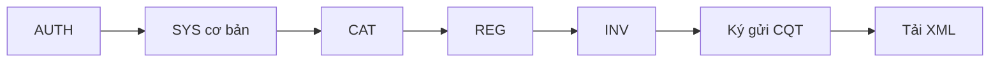
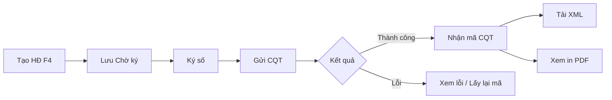

# MVP v1.0 — Trong phạm vi (In Scope)

| Version | Date | Author | Status |
|---------|------|--------|--------|
| 0.1 | 2026-10-03 | BA | Draft |

> **Đối xứng:** [mvp-v1.0-out-of-scope.md](mvp-v1.0-out-of-scope.md)  
> **Nguồn:** [DOC-03-brd.md](DOC-03-brd.md) · Workshop chốt tính năng (03/10/2026).

---

## 1. Tóm tắt

| Mục | Giá trị |
|-----|---------|
| **Baseline slice** | MVP v1.0 |
| **Module nghiệp vụ** | AUTH, CAT, REG, INV |
| **Module phụ thuộc** | SYS (tối thiểu) |
| **Tổng FR trong MVP** | **31 FR** |
| **Tiêu chí nghiệm thu** | DOC-01 S-01 — đăng ký → lập → ký → nhận mã CQT → tải XML |

### Luồng lõi

```text
Đăng nhập → Danh mục → Đăng ký phát hành → Lập HĐ → Ký → Gửi Thuế → Tải XML
   AUTH         CAT           REG              INV
                                    ↑
                              SYS (DN, CTS, tham số, user, quyền)
```



---

## 2. Ma trận module

| # | Module ID | Tên | Folder DOC | Số FR MVP | Vai trò |
|---|-----------|-----|------------|-----------|---------|
| 1 | AUTH | Xác thực & truy cập | `03-modules/auth/` | 4 | Cổng vào hệ thống |
| 2 | CAT | Danh mục | `03-modules/catalog/` | 5 | Master data phục vụ lập HĐ |
| 3 | REG | Đăng ký phát hành | `03-modules/register/` | 2 | Mẫu HĐ + tờ khai NĐ70 |
| 4 | INV | Hóa đơn đầu ra | `03-modules/invoice/` | 15 | Core phát hành end-to-end |
| 5 | SYS | Hệ thống & quản trị | `03-modules/system/` | 5 | Phụ thuộc bắt buộc |

---

## 3. Yêu cầu chức năng (FR) trong MVP

### 3.1 AUTH — Xác thực & truy cập

**Route:** `#/login`, `#/register`, `#/forgot-password`

| # | ID | Tính năng | Mô tả | BRD § |
|---|-----|-----------|-------|-------|
| 1 | AUTH-FR-01 | Đăng nhập | MST + tên đăng nhập + mật khẩu; ghi nhớ đăng nhập | 5.1 |
| 2 | AUTH-FR-02 | Đăng ký tài khoản | Link đăng ký từ màn hình login | 5.1 |
| 3 | AUTH-FR-03 | Quên mật khẩu | Nhập MST + email; hỗ trợ USB Token (bước xác thực) | 5.1 |
| 4 | AUTH-FR-04 | Đa ngôn ngữ | Chọn ngôn ngữ (VI) | 5.1 |

**Quy tắc nghiệp vụ áp dụng:**

| ID | Quy tắc |
|----|---------|
| BR-AUTH-01 | Nút Đăng nhập disabled khi thiếu trường bắt buộc |
| BR-AUTH-02 | Quên MK yêu cầu MST và email hợp lệ |

---

### 3.2 CAT — Danh mục

**Menu:** Danh mục

| # | ID | Tính năng | Mô tả | BRD § |
|---|-----|-----------|-------|-------|
| 1 | CAT-FR-01 | Khách hàng | Quản lý người mua; gợi ý từ MST đã lưu | 5.7 |
| 2 | CAT-FR-02 | Hàng hóa, dịch vụ | Master HH/DV, thuế suất | 5.7 |
| 3 | CAT-FR-03 | Đơn vị tính | UOM | 5.7 |
| 4 | CAT-FR-04 | Tiền tệ | VND, ngoại tệ + tỷ giá | 5.7 |
| 5 | CAT-FR-06 | Hình thức thanh toán | TM, CK, TM/CK, … | 5.7 |

**Loại khỏi MVP (tham chiếu):** CAT-FR-05 (mẫu email), CAT-FR-07 (ngân hàng), CAT-FR-08 (địa điểm KD), CAT-FR-11 (thiết bị) → [out-of-scope §3–§4](mvp-v1.0-out-of-scope.md).

---

### 3.3 REG — Đăng ký phát hành

**Menu:** Đăng ký phát hành

| # | ID | Tính năng | Mô tả | BRD § |
|---|-----|-----------|-------|-------|
| 1 | REG-FR-01 | Mẫu hóa đơn | Khai báo/quản lý mẫu HĐ theo quy định TCT | 5.2 |
| 2 | REG-FR-03 | Tờ khai NĐ70/2025 | Lập tờ khai theo NĐ 70/2025, NĐ 254/2026; ký, gửi CQT | 5.2 |

**Loại khỏi MVP:** REG-FR-02 (tờ khai NĐ123/2020).

**Luồng nghiệp vụ:**

```text
Khai báo mẫu HĐ → Lập tờ khai NĐ70 → Ký số → Gửi CQT → Chờ phê duyệt
```

---

### 3.4 INV — Hóa đơn đầu ra

**Route:** `#/hoa-don`

| # | ID | Tính năng | Mô tả | BRD § | Ghi chú MVP |
|---|-----|-----------|-------|-------|-------------|
| 1 | INV-FR-01 | Danh sách HĐ | Lọc theo trạng thái CQT, MST NM, ngày, số tiền | 5.3 | Lọc loại Chiết khấu hoãn (INV-FR-17 out) |
| 2 | INV-FR-02 | Tạo mới (F4) | Lập HĐ: ký hiệu, ngày, tiền tệ, tỷ giá, HT thanh toán | 5.3 | |
| 3 | INV-FR-03 | Thông tin bên bán | Lấy mặc định từ SYS → Thông tin DN; cho sửa | 5.3 | |
| 4 | INV-FR-04 | Thông tin người mua | MST → tra cứu CQT; tên ĐV, người mua, địa chỉ, email | 5.3 | |
| 5 | INV-FR-05 | Chi tiết HHDV | Thêm dòng: tên HH, SL, đơn giá, %VAT, thành tiền | 5.3 | |
| 6 | INV-FR-06 | Lưu nháp | HĐ trạng thái **Chờ ký** trước ký gửi CQT | 5.3 | |
| 7 | INV-FR-07 | Chỉnh sửa | Sửa HĐ chưa ký; disabled sau ký thành công | 5.3 | |
| 8 | INV-FR-08 | Xóa (F8) | Xóa HĐ chờ ký; quy tắc xóa tuần tự theo hình thức sinh số | 5.3 | |
| 9 | INV-FR-09 | Sao chép | Tạo HĐ mới từ HĐ có sẵn | 5.3 | |
| 10 | INV-FR-10 | Xem in | Xem trước/in PDF HĐ | 5.3 | |
| 11 | INV-FR-11 | Ký gửi CQT | Ký số + gửi CQT; Chờ ký → Thành công / Có lỗi | 5.3 | **Core MVP** |
| 12 | INV-FR-14 | Lấy lại mã CQT | Lấy lại mã khi truyền lỗi/treo | 5.3 | |
| 13 | INV-FR-16 | Tải XML | Export XML HĐ sau ký | 5.3 | Nâng từ Should → **Must MVP** |
| 14 | INV-FR-18 | Cập nhật TT từ CQT | Đồng bộ trạng thái HĐ từ CQT | 5.3 | |
| 15 | INV-FR-20 | Tổng tiền | Hiển thị tổng cộng danh sách HĐ | 5.3 | |

**Trạng thái HĐ (MVP):**

| Trạng thái gửi CQT | Ý nghĩa |
|--------------------|---------|
| Chờ ký | Nháp, chưa ký/gửi CQT |
| Thành công | Đã nhận mã CQT |
| Có lỗi | Gửi lỗi — xem chi tiết lỗi |

**Quy tắc nghiệp vụ áp dụng:**

| ID | Quy tắc | Ghi chú MVP |
|----|---------|-------------|
| BR-INV-01 | HĐ đã ký không sửa trực tiếp | Module ERR (thay thế/ĐC) out of scope — chỉ chặn sửa |
| BR-INV-02 | Hai hình thức sinh số (lập vs ký) | Cấu hình qua SYS-FR-06 |
| BR-INV-04 | Tra MST người mua từ dữ liệu CQT | |

**Luồng nghiệp vụ chính:**



---

### 3.5 SYS — Hệ thống & quản trị (phụ thuộc bắt buộc)

**Menu:** Hệ thống

| # | ID | Tính năng | Mô tả | BRD § | Lý do MVP |
|---|-----|-----------|-------|-------|-----------|
| 1 | SYS-FR-01 | Thông tin doanh nghiệp | MST, tên, địa chỉ, logo bên bán | 5.8 | Dữ liệu bên bán trên HĐ/tờ khai |
| 2 | SYS-FR-03 | Nhóm quyền | RBAC theo chức năng | 5.8 | Phân quyền tối thiểu |
| 3 | SYS-FR-04 | Người sử dụng | CRUD user, gán nhóm quyền | 5.8 | Vận hành tenant |
| 4 | SYS-FR-05 | Đăng ký chứng thư số | USB Token / HSM ký HĐ + tờ khai | 5.8 | Bắt buộc cho ký gửi CQT |
| 5 | SYS-FR-06 | Tham số hệ thống | Cấu hình nghiệp vụ (sinh số, quy tắc…) | 5.8 | BR-INV-02 |

**Hoãn Phase 2:** SYS-FR-02 (license), SYS-FR-07 (SMTP), SYS-FR-08, SYS-FR-09 → [out-of-scope](mvp-v1.0-out-of-scope.md).

---

## 4. NFR áp dụng cho MVP

| ID | Nhóm | Yêu cầu | Áp dụng MVP |
|----|------|---------|-------------|
| NFR-01 | Tuân thủ | NĐ 70, TT 78, TT 88, TT 32; mẫu HĐ TCT | ✅ (không NĐ123 tờ khai) |
| NFR-02 | Bảo mật | HTTPS, chữ ký số, RBAC | ✅ |
| NFR-03 | Lưu trữ | HĐ và lịch sử tối thiểu 10 năm | ✅ |
| NFR-04 | Hiệu năng | Volume HĐ theo SLA triển khai | ✅ (baseline) |
| NFR-06 | Tích hợp | Adapter T-VAN/CQT | ✅ (mock/stub cho dev nếu cần) |
| NFR-07 | Đa thiết bị | Web responsive; phím tắt F4/F8 | ✅ |
| NFR-08 | Đa ngôn ngữ | Tiếng Việt | ✅ |

**Hoãn / ngoài MVP:** NFR-05 (hỗ trợ 24/7 — SUP), API public (Q-02).

---

## 5. Thứ tự triển khai đề xuất

| Phase | Slice | Module / FR | Phụ thuộc |
|-------|-------|-------------|-----------|
| **P0** | Nền tảng | Jarvis host, multitenancy, AUTH-FR-01~03 | — |
| **P1** | Quản trị | SYS-FR-01, 03, 04, 05, 06 | P0 |
| **P2** | Danh mục | CAT-FR-01~04, 06 | P1 |
| **P3** | Đăng ký PH | REG-FR-01, 03 | P1 (CTS) |
| **P4** | Hóa đơn core | INV-FR-02~11, 06~08 | P2, P3 |
| **P5** | Hoàn thiện INV | INV-FR-01, 09, 10, 14, 16, 18, 20 | P4 |
| **P6** | Cổng & polish | AUTH-FR-02, 04 | P0 |

---

## 6. Tiêu chí nghiệm thu MVP (Acceptance)

| # | Kịch bản | Kết quả mong đợi |
|---|----------|------------------|
| AC-MVP-01 | Admin cấu hình DN + đăng ký CTS | Thông tin bên bán hiển thị đúng trên HĐ |
| AC-MVP-02 | Kế toán khai báo mẫu HĐ + gửi tờ khai NĐ70 | Tờ khai ký gửi CQT thành công |
| AC-MVP-03 | NV lập HĐ từ danh mục KH/HH/DV | HĐ lưu trạng thái Chờ ký |
| AC-MVP-04 | Ký gửi CQT một HĐ | Nhận mã CQT; trạng thái Thành công |
| AC-MVP-05 | Tải XML HĐ đã ký | File XML hợp lệ theo chuẩn TCT |
| AC-MVP-06 | Truyền lỗi / treo mã | Lấy lại mã CQT hoặc xem chi tiết lỗi |
| AC-MVP-07 | HĐ đã ký | Không cho sửa trực tiếp (BR-INV-01) |

**Tiêu chí dự án:** [DOC-01 §10 S-01](DOC-01-vision-business-case.md#10-tiêu-chí-thành-công-dự-án).

---

## 7. Giả định & ràng buộc MVP

| ID | Loại | Nội dung |
|----|------|----------|
| A-01 | Giả định | Khách hàng có chứng thư số hợp lệ (USB Token hoặc HSM) |
| A-02 | Giả định | DN đã đăng ký sử dụng HĐĐT với CQT |
| A-04 | Giả định | Tích hợp CQT qua T-VAN do đơn vị triển khai vận hành |
| C-01 | Ràng buộc | Tuân thủ NĐ 70/2025 và TT liên quan (không tờ khai NĐ123 trong MVP) |
| C-03 | Ràng buộc | Ký số bắt buộc trước gửi CQT |

---

## 8. Bảng tổng hợp FR

| Module | FR trong MVP | ID |
|--------|--------------|-----|
| AUTH | 4 | AUTH-FR-01, 02, 03, 04 |
| CAT | 5 | CAT-FR-01, 02, 03, 04, 06 |
| REG | 2 | REG-FR-01, 03 |
| INV | 15 | INV-FR-01, 02, 03, 04, 05, 06, 07, 08, 09, 10, 11, 14, 16, 18, 20 |
| SYS | 5 | SYS-FR-01, 03, 04, 05, 06 |
| **Tổng** | **31** | |

---

## 9. Traceability

| Artifact | Liên kết |
|----------|----------|
| BRD đầy đủ | [DOC-03-brd.md](DOC-03-brd.md) |
| Ngoài phạm vi MVP | [mvp-v1.0-out-of-scope.md](mvp-v1.0-out-of-scope.md) |
| Vision / S-01 | [DOC-01-vision-business-case.md](DOC-01-vision-business-case.md) |
| Kiến trúc | [DOC-08-sad.md](../04-platform/DOC-08-sad.md) |
| Module SRS | `docs/03-modules/{module-id}/DOC-06-srs.md` |
| Trace matrix | [trace-matrix.md](../05-traceability/trace-matrix.md) |

---

## Approval

| Vai trò | Tên | Ngày | Sign-off |
|---------|-----|------|----------|
| Product Owner / Sponsor | *TBD* | — | ☐ |
| REQ owner | *TBD* | — | ☐ |
