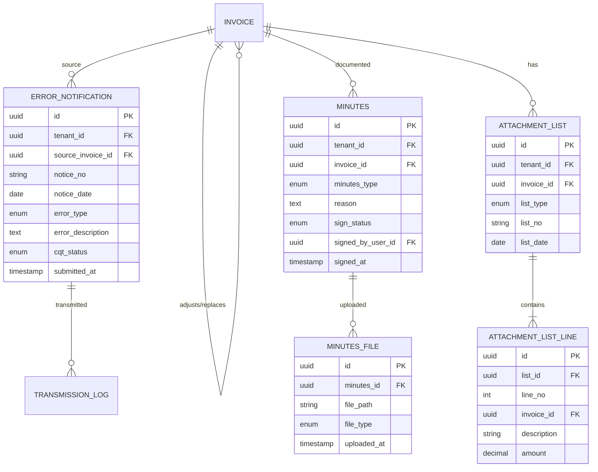

# DOC-10 — ERD — error-handling (ERR)

| Version | Date | Author | Status |
|---------|------|--------|--------|
| 0.2 | 2026-10-02 | BA | Draft |

---

## Quy ước audit & multi-tenant (Minipower core)

Mọi bảng nghiệp vụ kế thừa trường chuẩn từ **Minipower core framework**. Không vẽ trong diagram — filter tenant/org, audit trail và soft-delete do framework xử lý.

| Field | Kiểu | Mô tả |
|-------|------|-------|
| TenantId | UUID | Phân vùng tenant (doanh nghiệp) |
| OrgId | UUID | Đơn vị tổ chức trong tenant |
| CreatedBy | UUID | Người tạo |
| CreatedAt | TIMESTAMP | Thời điểm tạo |
| UpdatedBy | UUID | Người cập nhật |
| UpdatedAt | TIMESTAMP | Thời điểm cập nhật |
| DeletedAt | TIMESTAMP | Thời điểm xóa mềm (nullable) |
| DeletedBy | UUID | Người xóa (nullable) |
| DeletedId | UUID | Định danh xóa mềm / bản ghi thay thế (nullable) |

---

## Thực thể

## Quan hệ

| Từ | Đến | Cardinality | Ghi chú |
|----|-----|-------------|---------|
| invoice (gốc) | invoice (ĐC/TT) | 1—N | Qua `root_invoice_id` / `parent_invoice_id` |
| invoice | error_notification | 1—N | 04/SS cho sai sót nhỏ |
| invoice | minutes | 1—N | Biên bản kèm ĐC/TT |
| invoice | attachment_list | 1—N | Bảng kê thường / ĐC-TT / chiết khấu |
| minutes | minutes_file | 1—N | Upload biên bản đã ký 2 bên |

**Lưu ý:** HĐ điều chỉnh/thay thế lưu trong bảng `invoice` (INV) với `invoice_type` và liên kết chuỗi; module ERR quản lý metadata xử lý sai sót.
