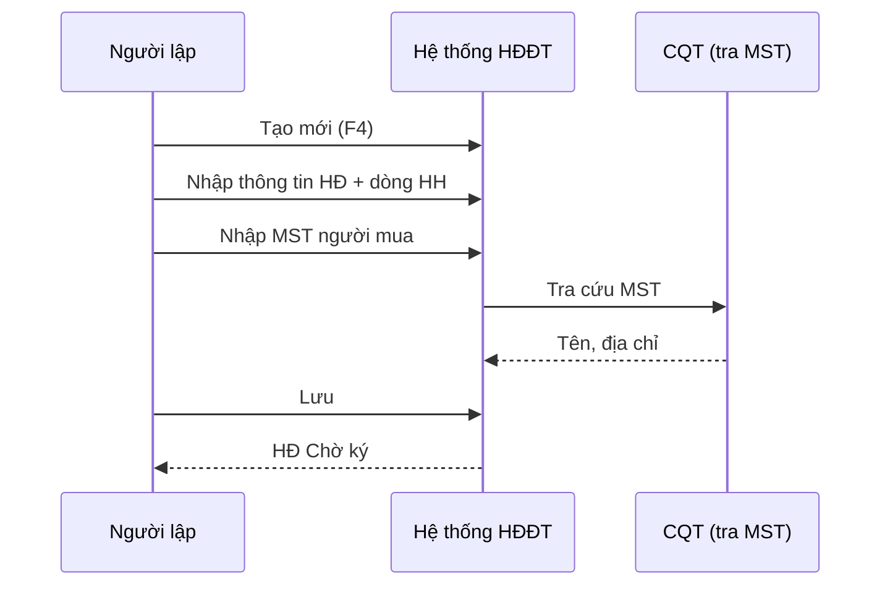

# DOC-05 — Use Cases — invoice (INV)

| Version | Date | Author | Status |
|---------|------|--------|--------|
| 0.1 | 2026-10-01 | BA | Draft |

**Route:** `#/hoa-don`

---

## 1. Actor Catalog

| Actor ID | Tên | Loại |
|----------|-----|------|
| ACT-INV-01 | Kế toán / NV lập HĐ | Primary |
| ACT-INV-02 | Khách hàng (người mua) | Secondary |
| ACT-SYS-03 | Cơ quan Thuế | External |
| ACT-SYS-04 | Email server | System |

## 2. Use Case List

| UC ID | Tên | Priority | FR |
|-------|-----|----------|-----|
| INV-UC-001 | Tra cứu danh sách hóa đơn | Must | INV-FR-01, 20 |
| INV-UC-002 | Lập hóa đơn mới | Must | INV-FR-02–06 |
| INV-UC-003 | Sửa hóa đơn chờ ký | Must | INV-FR-07 |
| INV-UC-004 | Xóa hóa đơn chờ ký | Must | INV-FR-08 |
| INV-UC-005 | Sao chép hóa đơn | Must | INV-FR-09 |
| INV-UC-006 | Xem in hóa đơn | Must | INV-FR-10 |
| INV-UC-007 | Ký gửi Cơ quan thuế | Must | INV-FR-11 |
| INV-UC-008 | Gửi email hóa đơn | Must | INV-FR-12 |
| INV-UC-009 | Ký hóa đơn hàng loạt | Should | INV-FR-13 |
| INV-UC-010 | Lấy lại mã Cơ quan thuế | Must | INV-FR-14 |
| INV-UC-011 | Import hóa đơn từ Excel | Should | INV-FR-15 |
| INV-UC-012 | Tải XML hóa đơn | Should | INV-FR-16 |
| INV-UC-013 | Lập hóa đơn chiết khấu | Must | INV-FR-17 |
| INV-UC-014 | Cập nhật trạng thái từ CQT | Must | INV-FR-18 |
| INV-UC-015 | Chuyển ký hiệu hóa đơn | Should | INV-FR-19 |

---

## 3. Use Case Specifications

### INV-UC-001 — Tra cứu danh sách hóa đơn

| Mục | Nội dung |
|-----|----------|
| **Actor** | ACT-INV-01 |
| **Mô tả** | Xem, lọc, phân trang danh sách HĐ đầu ra |
| **Tiền điều kiện** | Đã đăng nhập; có quyền xem HĐ |

**Luồng chính:**
1. Vào **Hóa đơn đầu ra** (`#/hoa-don`)
2. Hệ thống hiển thị bảng: loại (Gốc/Chiết khấu), trạng thái CQT, mã CQT, ký hiệu, ngày, MST NM, tên NM, tổng tiền, HTTT, người lập
3. NSD lọc theo cột (textbox filter trên header)
4. Hệ thống hiển thị tổng cộng số tiền cuối bảng

**Cột trạng thái:** Chờ ký · Thành công · Có lỗi (INV-BR-06)

---

### INV-UC-002 — Lập hóa đơn mới

| Mục | Nội dung |
|-----|----------|
| **Actor** | ACT-INV-01 |
| **Trigger** | Tạo mới (F4) |
| **Hậu điều kiện** | HĐ lưu trạng thái **Chờ ký** |

**Luồng chính:**
1. Chọn ký hiệu HĐ (nếu DN có nhiều ký hiệu)
2. Bấm **Tạo mới (F4)**
3. Nhập thông tin chung: ngày HĐ, tiền tệ, tỷ giá, HT thanh toán
4. Thông tin bên bán: mặc định từ Hệ thống → Thông tin DN (cho sửa)
5. Thông tin người mua: nhập MST → **Tìm kiếm** → điền tên, địa chỉ, email, SĐT, TK (INV-BR-04)
6. Thêm dòng HHDV: tên, SL, đơn giá, %VAT → hệ thống tính thành tiền, thuế, tổng
7. Bấm **Lưu** → HĐ trạng thái Chờ ký

---

### INV-UC-003 — Sửa hóa đơn chờ ký

| Mục | Nội dung |
|-----|----------|
| **Tiền điều kiện** | HĐ trạng thái **Chờ ký** |
| **Hậu điều kiện** | HĐ cập nhật; vẫn Chờ ký |

**Luồng chính:** Chọn HĐ → **Chỉnh sửa** → sửa nội dung → **Lưu**

**Luồng thay thế:**
- HĐ Thành công/Có lỗi → nút Chỉnh sửa **disabled** (INV-BR-01)

---

### INV-UC-004 — Xóa hóa đơn chờ ký

| Mục | Nội dung |
|-----|----------|
| **Trigger** | Xóa (F8) |
| **Tiền điều kiện** | HĐ Chờ ký |

**Luồng chính:**
1. Chọn HĐ chờ ký
2. Bấm **Xóa (F8)** → xác nhận
3. Hệ thống xóa HĐ

**Luồng thay thế (INV-BR-02):** Sinh số khi lập — chỉ xóa được từ số lớn nhất trở xuống tuần tự

---

### INV-UC-005 — Sao chép hóa đơn

**Luồng chính:** Chọn HĐ mẫu → **Sao chép** → HĐ mới pre-fill → chỉnh sửa → **Lưu**

---

### INV-UC-006 — Xem in hóa đơn

**Luồng chính:** Chọn HĐ → **Xem in** → preview PDF → in (Ctrl+P) hoặc tải

---

### INV-UC-007 — Ký gửi Cơ quan thuế

| Mục | Nội dung |
|-----|----------|
| **Actor** | ACT-INV-01, ACT-SYS-03 |
| **Tiền điều kiện** | HĐ Chờ ký; chứng thư số đã cài plugin |
| **Hậu điều kiện** | Thành công (mã CQT) hoặc Có lỗi |

**Luồng chính:**
1. Chọn HĐ Chờ ký
2. Bấm **Ký gửi CQT**
3. Chọn chữ ký số (USB Token) → OK
4. Hệ thống ký XML, gửi CQT
5. Cập nhật trạng thái: Thành công (xanh) / Có lỗi (đỏ — bấm xem lỗi)

---

### INV-UC-008 — Gửi email hóa đơn

**Luồng chính:** Chọn HĐ (đã phát hành) → **Gửi email** → gửi PDF tới email người mua → lưu trạng thái gửi

**Luồng thay thế:** HĐ Chờ ký — vẫn có thể gửi tùy cấu hình (demo: enabled)

---

### INV-UC-009 — Ký hóa đơn hàng loạt

**Luồng chính:** Chọn nhiều HĐ Chờ ký → **Ký hóa đơn hàng loạt** → ký tuần tự/hàng loạt → báo kết quả từng HĐ

---

### INV-UC-010 — Lấy lại mã Cơ quan thuế

**Luồng chính:** Chọn HĐ Có lỗi/treo → **Lấy lại mã cơ quan thuế** → hệ thống query CQT → cập nhật mã nếu thành công

---

### INV-UC-011 — Import hóa đơn từ Excel

**Luồng chính:** **Chức năng** → **Nhận Excel** → chọn file template → validate → import → danh sách HĐ Chờ ký

---

### INV-UC-012 — Tải XML hóa đơn

**Luồng chính:** **Chức năng** → **Tải XML** → export XML HĐ đã chọn

---

### INV-UC-013 — Lập hóa đơn chiết khấu

**Luồng chính:** **Thêm HĐ chiết khấu** → lập HĐ loại Chiết khấu, tổng tiền âm (INV-BR-05) → lưu → ký gửi CQT

---

### INV-UC-014 — Cập nhật trạng thái từ CQT

**Luồng chính:** **Chức năng** → **Cập nhật trạng thái HĐ từ CQT** → đồng bộ trạng thái/mã CQT cho HĐ đã gửi

---

### INV-UC-015 — Chuyển ký hiệu hóa đơn

**Luồng chính:** **Chức năng** → **Chuyển ký hiệu hóa đơn** → chọn ký hiệu đích → chuyển HĐ chờ ký
