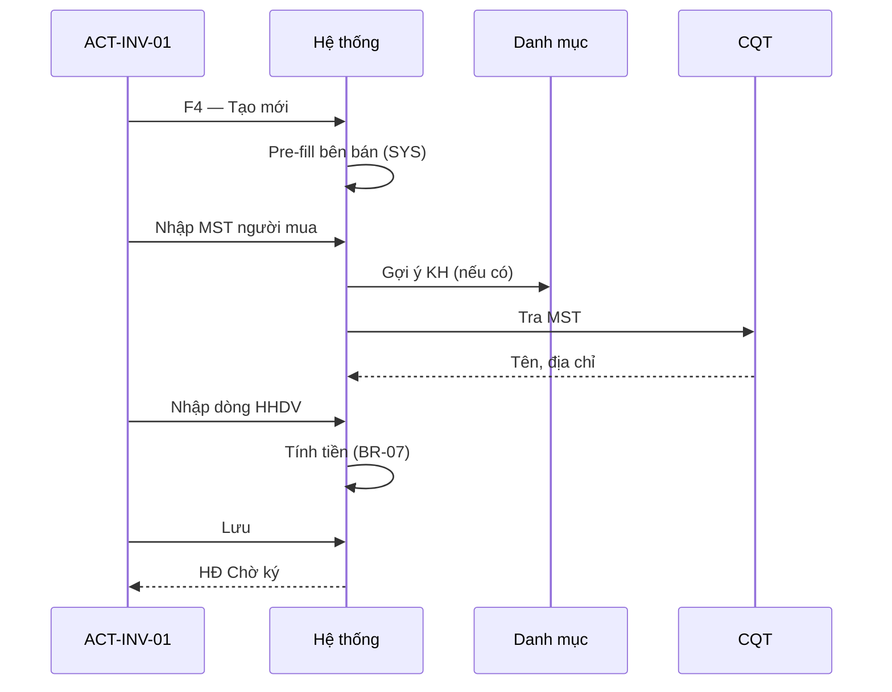

# DOC-05 — Use Cases — invoice (INV)

| Version | Date | Author | Status |
|---------|------|--------|--------|
| — | 2026-10-03 | BA | Draft |

**Route einvoice:** `/hoa-don` · **SRS:** [DOC-06-srs.md](DOC-06-srs.md) · **BR:** [DOC-04-business-rules.md](DOC-04-business-rules.md)  
**Wireframe:** [DOC-19-prototype.md](DOC-19-prototype.md) · **UI:** [DOC-20 §4.1](../../00-governance/DOC-20-ui-design-principles.md#41-pattern-l--list-crud)

---

## 1. Actor Catalog

| Actor ID | Tên | Loại | Mô tả |
|----------|-----|------|-------|
| ACT-INV-01 | Kế toán / NV lập HĐ | Primary | Lập, sửa, ký, tra cứu HĐ đầu ra |
| ACT-INV-02 | Khách hàng (người mua) | Secondary | Nhận email/PDF HĐ (Phase 2) |
| ACT-SYS-03 | Cơ quan Thuế (CQT) | External | Nhận XML, trả mã/trạng thái |
| ACT-SYS-04 | Email server | System | Gửi PDF (Phase 2) |
| ACT-SYS-05 | Plugin ký số | System | USB Token / HSM ký XML |

---

## 2. Use Case List

| UC ID | Tên | MVP | Priority | FR |
|-------|-----|-----|----------|-----|
| INV-UC-001 | Tra cứu danh sách hóa đơn | ✅ | Must | INV-FR-01, 20 |
| INV-UC-002 | Lập hóa đơn mới | ✅ | Must | INV-FR-02–06 |
| INV-UC-003 | Sửa hóa đơn chờ ký | ✅ | Must | INV-FR-07 |
| INV-UC-004 | Xóa hóa đơn chờ ký | ✅ | Must | INV-FR-08 |
| INV-UC-005 | Sao chép hóa đơn | ✅ | Must | INV-FR-09 |
| INV-UC-006 | Xem in hóa đơn | ✅ | Must | INV-FR-10 |
| INV-UC-007 | Ký gửi Cơ quan thuế | ✅ | Must | INV-FR-11 |
| INV-UC-008 | Gửi email hóa đơn | ❌ | Must* | INV-FR-12 |
| INV-UC-009 | Ký hóa đơn hàng loạt | ❌ | Should | INV-FR-13 |
| INV-UC-010 | Lấy lại mã Cơ quan thuế | ✅ | Must | INV-FR-14 |
| INV-UC-011 | Import hóa đơn từ Excel | ❌ | Should | INV-FR-15 |
| INV-UC-012 | Tải XML hóa đơn | ✅ | Must | INV-FR-16 |
| INV-UC-013 | Lập hóa đơn chiết khấu | ❌ | Must* | INV-FR-17 |
| INV-UC-014 | Cập nhật trạng thái từ CQT | ✅ | Must | INV-FR-18 |
| INV-UC-015 | Chuyển ký hiệu hóa đơn | ❌ | Should | INV-FR-19 |

*\*Must trong BRD tổng — **out MVP v1.0** slice.*

---

## 3. Use Case Specifications (MVP)

### INV-UC-001 — Tra cứu danh sách hóa đơn

| Mục | Nội dung |
|-----|----------|
| **Actor** | ACT-INV-01 |
| **Mục tiêu** | Tìm và theo dõi HĐ đầu ra theo trạng thái, kỳ, khách hàng |
| **Tiền điều kiện** | Đăng nhập; quyền `invoice.view`; tenant active |
| **Hậu điều kiện** | Danh sách hiển thị đúng filter; tổng tiền cập nhật |
| **Trigger** | Menu **Hóa đơn đầu ra** hoặc route `/hoa-don` |

**Luồng chính:**

1. NSD mở trang **Hóa đơn đầu ra**
2. Hệ thống load danh sách HĐ (paginator 50/trang); mặc định filter ngày = tháng hiện tại (optional)
3. NSD nhập **Bộ lọc nâng cao**: Từ ngày, Đến ngày, Ký hiệu, Trạng thái, MST, …
4. NSD bấm **Tìm** → API trả kết quả
5. NSD lọc thêm trên **filter inline** cột (AND)
6. Footer hiển thị **Tổng: {sum}** theo bộ lọc hiện tại

**Luồng thay thế:**

| # | Điều kiện | Hành vi |
|---|-----------|---------|
| 1a | Không có bản ghi | Hiển thị *"Không tìm thấy kết quả"* (màu đỏ) |
| 1b | **Tải dữ liệu** | Reload giữ filter/pagination |
| 1c | Chọn ký hiệu (context) trước khi F4 | Lọc danh sách theo ký hiệu đang chọn |

**Cột bảng (MVP):**

| Cột | Mô tả |
|-----|-------|
| TT | Loại: Gốc (MVP chỉ Gốc) |
| Tr.thái | Chờ ký / Thành công / Có lỗi (INV-BR-06) |
| Tr.CQT | Chi tiết phản hồi CQT |
| Mã CQT | Mã cấp sau ký thành công |
| Ký hiệu | VD: `1C26TAH` |
| Ngày HĐ | `DD/MM/YYYY` |
| Số HĐ | Số phát hành |
| MST | MST người mua |
| Tên KH | Tên người mua / đơn vị |
| Tổng tiền | Tabular-nums; âm nếu CK (P2) |
| Thao tác | Row actions |

---

### INV-UC-002 — Lập hóa đơn mới

| Mục | Nội dung |
|-----|----------|
| **Actor** | ACT-INV-01 |
| **Trigger** | **Tạo mới (F4)** |
| **Tiền điều kiện** | Quyền `invoice.create`; có ≥1 mẫu/ký hiệu REG-FR-01; danh mục CAT sẵn sàng |
| **Hậu điều kiện** | HĐ mới trạng thái **Chờ ký**; hiển thị trên danh sách |

**Luồng chính:**

1. (Optional) Chọn **Ký hiệu HĐ** trên filter/context bar
2. Bấm **Tạo mới (F4)** → mở modal full-width *"Tạo mới Hóa đơn giá trị gia tăng"*
3. **Thông tin chung:** Ký hiệu*, Ngày HĐ*, Tiền tệ*, Tỷ giá*, HTTT*, Số ĐH/BK CK
4. **Bên bán:** Pre-fill SYS-FR-01; cho sửa MST, tên, địa chỉ, email, SĐT, STK
5. **Người mua:** Nhập MST → **Tìm kiếm** (INV-BR-04); chọn KH từ danh mục `[+]`
6. **Grid HHDV:** Thêm dòng (F9); nhập mã HH, tên, UOM, SL, đơn giá, %VAT (INV-BR-07)
7. Kiểm tra vùng **Tổng cộng** + bằng chữ
8. **Lưu** → validate → persist → toast success → đóng modal → refresh list

**Luồng thay thế:**

| # | Nhánh | Hành vi |
|---|-------|---------|
| 2a | **Lưu & ký** | Lưu → mở luồng INV-UC-007 ngay |
| 2b | **Xem trước** | Preview PDF không lưu |
| 2c | Validation fail | `[INV-VAL-xxx]` inline + banner; không đóng modal |
| 2d | Đóng modal khi dirty | Confirm *"Bỏ thay đổi?"* |

---

### INV-UC-003 — Sửa hóa đơn chờ ký

| Mục | Nội dung |
|-----|----------|
| **Tiền điều kiện** | HĐ `Chờ ký`; `signed = false` |
| **Trigger** | **Chỉnh sửa (F3)** hoặc row action **Sửa** (1 dòng) |

**Luồng chính:** Chọn 1 HĐ → F3 → modal pre-fill → sửa → **Lưu** → cập nhật; vẫn Chờ ký

**Luồng thay thế:**

| # | Điều kiện | Hành vi |
|---|-----------|---------|
| 3a | HĐ Thành công / Có lỗi đã ký | Disabled (INV-BR-01) |
| 3b | Chọn >1 dòng | F3 disabled |

---

### INV-UC-004 — Xóa hóa đơn chờ ký

| Mục | Nội dung |
|-----|----------|
| **Trigger** | **Xóa (F8)** |
| **Tiền điều kiện** | HĐ `Chờ ký`; quyền `invoice.delete` |

**Luồng chính:**

1. Chọn ≥1 HĐ Chờ ký
2. F8 → dialog xác nhận *"Xóa N hóa đơn?"*
3. Hệ thống kiểm tra INV-BR-02 hoặc INV-BR-03 theo SYS-FR-06
4. Xóa thành công → toast; refresh list

**Luồng thay thế:**

| # | Điều kiện | Hành vi |
|---|-----------|---------|
| 4a | Vi phạm BR-02 | Toast `[INV-BR-02] …`; không xóa |
| 4b | HĐ đã ký | Disabled / `[INV-BR-01]` |

---

### INV-UC-005 — Sao chép hóa đơn

| Mục | Nội dung |
|-----|----------|
| **Trigger** | Row action **Sao chép** |
| **Tiền điều kiện** | ≥1 HĐ bất kỳ trạng thái (MVP: 1 dòng) |

**Luồng chính:**

1. Chọn HĐ nguồn → **Sao chép**
2. Mở modal tạo mới pre-fill toàn bộ field (trừ số HĐ, mã CQT)
3. NSD chỉnh → **Lưu** → HĐ mới **Chờ ký**

---

### INV-UC-006 — Xem in hóa đơn

| Mục | Nội dung |
|-----|----------|
| **Trigger** | Row action **Xem in** |
| **Tiền điều kiện** | 1 HĐ được chọn |

**Luồng chính:**

1. Chọn HĐ → **Xem in**
2. Hệ thống render PDF/HTML theo mẫu REG-FR-01
3. NSD in (Ctrl+P) hoặc tải PDF (browser)

---

### INV-UC-007 — Ký gửi Cơ quan thuế

| Mục | Nội dung |
|-----|----------|
| **Actor** | ACT-INV-01, ACT-SYS-03, ACT-SYS-05 |
| **Trigger** | Row **Ký gửi CQT** · modal **Lưu & ký** |
| **Tiền điều kiện** | HĐ Chờ ký; CTS hợp lệ (INV-BR-08) |
| **Hậu điều kiện** | Thành công + mã CQT **hoặc** Có lỗi + chi tiết |

**Luồng chính:**

1. Chọn HĐ Chờ ký
2. **Ký gửi CQT**
3. Chọn CTS / plugin ký → xác nhận PIN
4. Hệ thống: build XML → ký → gửi adapter CQT
5. CQT trả mã → cập nhật `Thành công`, điền Mã CQT
6. Toast `[INV-API-200] Ký gửi CQT thành công`

**Luồng thay thế:**

| # | Nhánh | Hành vi |
|---|-------|---------|
| 7a | CQT lỗi nghiệp vụ | Trạng thái **Có lỗi**; tooltip/modal `[CQT-xxx] message` |
| 7b | Không CTS | `[INV-BR-08] …` |
| 7c | Timeout | Có lỗi/treo → gợi ý **Lấy lại mã CQT** (UC-010) |

---

### INV-UC-010 — Lấy lại mã Cơ quan thuế

| Mục | Nội dung |
|-----|----------|
| **Trigger** | Toolbar **Lấy lại mã CQT** |
| **Tiền điều kiện** | ≥1 HĐ `Có lỗi` hoặc trạng thái treo (đã gửi, chưa có mã) |

**Luồng chính:**

1. Chọn HĐ → **Lấy lại mã CQT**
2. Hệ thống query CQT theo mã giao dịch / ký hiệu+số
3. Cập nhật mã + **Thành công** hoặc báo lỗi chi tiết

---

### INV-UC-012 — Tải XML hóa đơn

| Mục | Nội dung |
|-----|----------|
| **Trigger** | **Chức năng ▾** → **Tải XML** |
| **Tiền điều kiện** | ≥1 HĐ **Thành công** (đã ký) |

**Luồng chính:**

1. Chọn HĐ thành công
2. **Tải XML** → download file `.xml` (1 file hoặc zip nếu nhiều dòng — MVP: 1 HĐ/lần)
3. XML tuân INV-NFR-01

**Luồng thay thế:** HĐ Chờ ký → disabled hoặc `[INV-VAL-010] Chỉ tải XML hóa đơn đã ký thành công`

---

### INV-UC-014 — Cập nhật trạng thái từ CQT

| Mục | Nội dung |
|-----|----------|
| **Trigger** | **Chức năng ▾** → **Cập nhật TT CQT** |
| **Tiền điều kiện** | Có HĐ đã gửi trong phạm vi filter |

**Luồng chính:**

1. (Optional) Lọc kỳ / ký hiệu
2. **Cập nhật TT CQT** → job đồng bộ batch
3. Cập nhật cột Tr.thái, Tr.CQT, Mã CQT
4. Toast tổng kết: *"Đã cập nhật X/Y hóa đơn"*

---

## 4. Use Cases — Out of MVP (tóm tắt)

| UC | Mô tả ngắn | Ghi chú |
|----|------------|---------|
| INV-UC-008 | Gửi email PDF | Cần SYS email + CAT mẫu email |
| INV-UC-009 | Ký hàng loạt | Toolbar; queue ký tuần tự |
| INV-UC-011 | Nhận Excel | Template import; validate batch |
| INV-UC-013 | HĐ chiết khấu | Nút riêng; INV-BR-05 |
| INV-UC-015 | Chuyển ký hiệu | Chức năng ▾; HĐ Chờ ký only |

---

## 5. Ma trận UC → màn hình

| UC | Màn hình | Pattern |
|----|----------|---------|
| UC-001, 004, 005, 007, 010, 012, 014 | SCR-INV-LIST | L |
| UC-002, 003, 005 (edit) | SCR-INV-FORM (modal) | D |
| UC-006 | SCR-INV-PREVIEW | Dialog / tab mới |
| UC-007 (Lưu&ký) | SCR-INV-FORM + sign | D + plugin |
