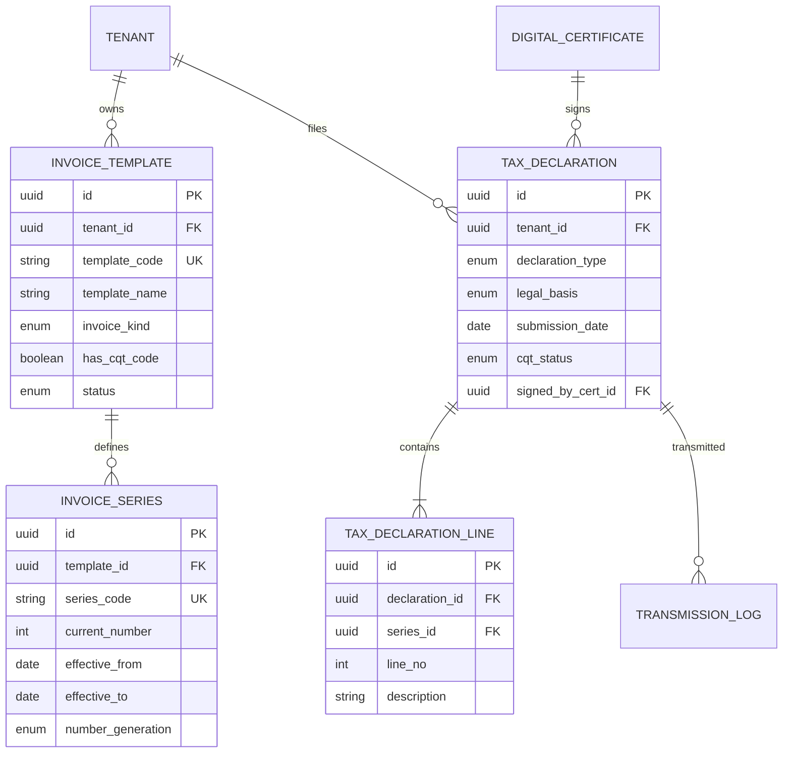

# DOC-10 — ERD — register (REG)

| Version | Date | Author | Status |
|---------|------|--------|--------|
| 0.2 | 2026-10-02 | BA | Draft |

---

## Quy ước audit & multi-tenant (Minipower core)

Mọi bảng nghiệp vụ kế thừa trường chuẩn từ **Minipower core framework**. Không vẽ trong diagram — filter tenant/org, audit trail và soft-delete do framework xử lý.

| Field | Kiểu | Mô tả |
|-------|------|-------|
| TenantId | UUID | Phân vùng tenant (doanh nghiệp) |
| OrgId | UUID | Đơn vị tổ chức trong tenant |
| CreatedBy | UUID | Người tạo |
| CreatedAt | TIMESTAMP | Thời điểm tạo |
| UpdatedBy | UUID | Người cập nhật |
| UpdatedAt | TIMESTAMP | Thời điểm cập nhật |
| DeletedAt | TIMESTAMP | Thời điểm xóa mềm (nullable) |
| DeletedBy | UUID | Người xóa (nullable) |
| DeletedId | UUID | Định danh xóa mềm / bản ghi thay thế (nullable) |

---

## Thực thể

## Quan hệ

| Từ | Đến | Cardinality | Ghi chú |
|----|-----|-------------|---------|
| invoice_template | invoice_series | 1—N | Một mẫu nhiều ký hiệu |
| tax_declaration | tax_declaration_line | 1—N | Chi tiết tờ khai |
| tax_declaration | transmission_log | 1—N | Log gửi CQT (TXN) |
| invoice_series | invoice | 1—N | HĐ dùng ký hiệu (INV) |
