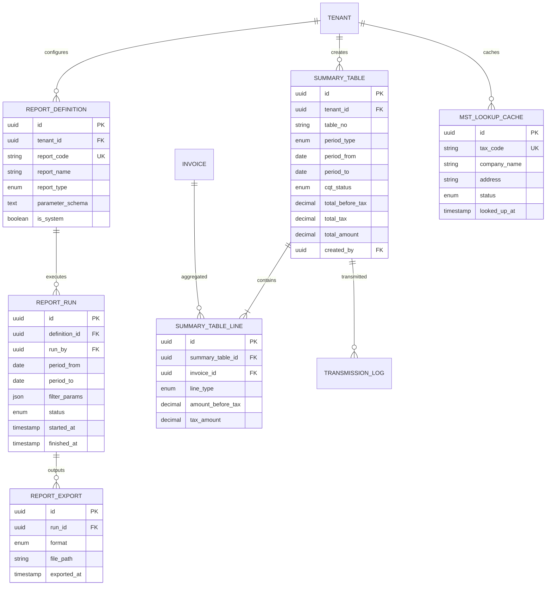

# DOC-10 — ERD — report (RPT)

| Version | Date | Author | Status |
|---------|------|--------|--------|
| 0.2 | 2026-10-02 | BA | Draft |

---

## Quy ước audit & multi-tenant (Minipower core)

Mọi bảng nghiệp vụ kế thừa trường chuẩn từ **Minipower core framework**. Không vẽ trong diagram — filter tenant/org, audit trail và soft-delete do framework xử lý.

| Field | Kiểu | Mô tả |
|-------|------|-------|
| TenantId | UUID | Phân vùng tenant (doanh nghiệp) |
| OrgId | UUID | Đơn vị tổ chức trong tenant |
| CreatedBy | UUID | Người tạo |
| CreatedAt | TIMESTAMP | Thời điểm tạo |
| UpdatedBy | UUID | Người cập nhật |
| UpdatedAt | TIMESTAMP | Thời điểm cập nhật |
| DeletedAt | TIMESTAMP | Thời điểm xóa mềm (nullable) |
| DeletedBy | UUID | Người xóa (nullable) |
| DeletedId | UUID | Định danh xóa mềm / bản ghi thay thế (nullable) |

---

## Thực thể

## Loại báo cáo → nguồn dữ liệu

| report_code | Nguồn chính |
|-------------|-------------|
| RPT_USAGE | invoice, license |
| RPT_SUMMARY | invoice (aggregate) |
| RPT_DETAIL | invoice, invoice_line |
| RPT_PL01 | invoice, attachment_list |
| RPT_PL101 | invoice (theo mẫu PL101) |
| RPT_01_TH | summary_table |
