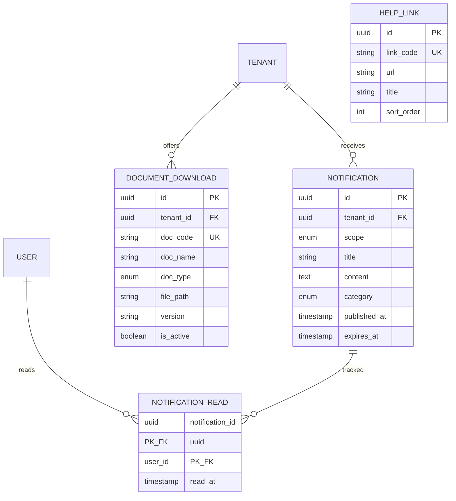

# DOC-10 — ERD — support (SUP)

| Version | Date | Author | Status |
|---------|------|--------|--------|
| 0.2 | 2026-10-02 | BA | Draft |

---

## Quy ước audit & multi-tenant (Minipower core)

Mọi bảng nghiệp vụ kế thừa trường chuẩn từ **Minipower core framework**. Không vẽ trong diagram — filter tenant/org, audit trail và soft-delete do framework xử lý.

| Field | Kiểu | Mô tả |
|-------|------|-------|
| TenantId | UUID | Phân vùng tenant (doanh nghiệp) |
| OrgId | UUID | Đơn vị tổ chức trong tenant |
| CreatedBy | UUID | Người tạo |
| CreatedAt | TIMESTAMP | Thời điểm tạo |
| UpdatedBy | UUID | Người cập nhật |
| UpdatedAt | TIMESTAMP | Thời điểm cập nhật |
| DeletedAt | TIMESTAMP | Thời điểm xóa mềm (nullable) |
| DeletedBy | UUID | Người xóa (nullable) |
| DeletedId | UUID | Định danh xóa mềm / bản ghi thay thế (nullable) |

---

## Thực thể

## Ghi chú

- **Chat hỗ trợ:** Tích hợp widget bên thứ ba — không lưu schema chat trong DB nội bộ (chỉ cấu hình `system_parameter` nếu cần).
- **Marketing lead:** Thực thể `support_lead` nằm trong module AUTH (đăng ký ưu đãi từ popup).
