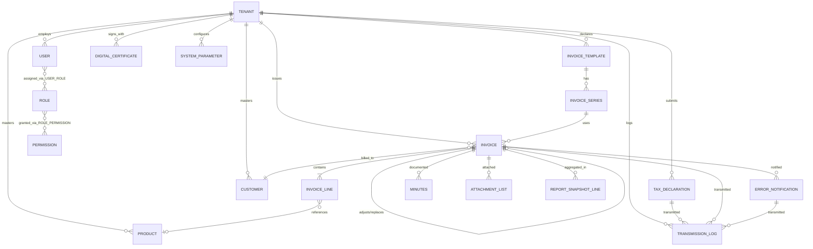
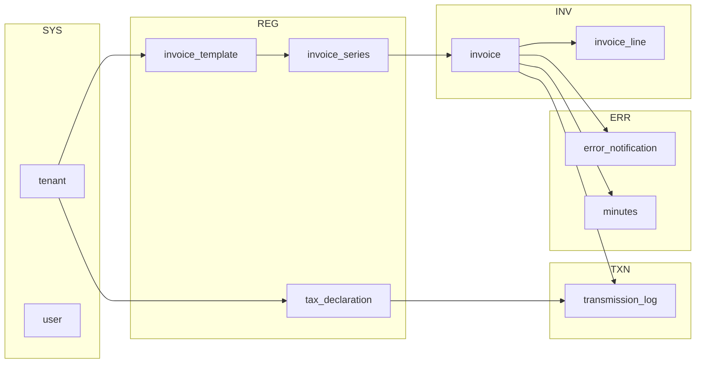

# DOC-10 — ERD tổng quan — Nền tảng HĐĐT

| Version | Date | Author | Status |
|---------|------|--------|--------|
| 0.2 | 2026-10-02 | BA | Draft |

> **BRD:** [DOC-03-brd.md](../01-project/DOC-03-brd.md)  
> **Module ERD:** [03-modules README](../03-modules/README.md) · [DOC-03 module index](../01-project/DOC-03-brd.md#8-module-index-traceability)

---

## 1. Mục đích

Mô tả quan hệ thực thể **cấp platform** giữa các bounded context của nền tảng HĐĐT. Chi tiết thuộc tính và ràng buộc xem ERD từng module.

## 2. Quy ước

| Ký hiệu | Ý nghĩa |
|---------|---------|
| `PK` | Khóa chính |
| `FK` | Khóa ngoại |
| `UK` | Unique |
| `1—N` | Một-nhiều |
| `N—N` | Nhiều-nhiều (qua bảng trung gian) |

### 2.1 Audit & multi-tenant (Minipower core)

Mọi bảng nghiệp vụ kế thừa trường chuẩn từ **Minipower core framework**. Không vẽ trong diagram — filter tenant/org, audit trail và soft-delete do framework xử lý.

| Field | Kiểu | Mô tả |
|-------|------|-------|
| TenantId | UUID | Phân vùng tenant (doanh nghiệp) |
| OrgId | UUID | Đơn vị tổ chức trong tenant |
| CreatedBy | UUID | Người tạo |
| CreatedAt | TIMESTAMP | Thời điểm tạo |
| UpdatedBy | UUID | Người cập nhật |
| UpdatedAt | TIMESTAMP | Thời điểm cập nhật |
| DeletedAt | TIMESTAMP | Thời điểm xóa mềm (nullable) |
| DeletedBy | UUID | Người xóa (nullable) |
| DeletedId | UUID | Định danh xóa mềm / bản ghi thay thế (nullable) |

**Ngoại lệ:** Bảng junction (N—N), bảng tham chiếu hệ thống toàn cục (`permission`), log append-only (`transmission_log`) — áp dụng theo quy ước core tương ứng.

Các mục §5 và ERD module chỉ liệt kê **trường nghiệp vụ**; trường audit & multi-tenant xem bảng trên.

---

## 3. ERD tổng quan (bounded context)

---

## 4. Danh mục thực thể theo module

| Module | Thực thể chính | ERD chi tiết |
|--------|----------------|--------------|
| AUTH | `user_session`, `password_reset_token`, `registration_request` | [auth/DOC-10-erd.md](../03-modules/auth/DOC-10-erd.md) |
| REG | `invoice_template`, `invoice_series`, `tax_declaration` | [register/DOC-10-erd.md](../03-modules/register/DOC-10-erd.md) |
| INV | `invoice`, `invoice_line`, `invoice_party` | [invoice/DOC-10-erd.md](../03-modules/invoice/DOC-10-erd.md) |
| ERR | `error_notification`, `minutes`, `attachment_list` | [error-handling/DOC-10-erd.md](../03-modules/error-handling/DOC-10-erd.md) |
| TXN | `transmission_log`, `transmission_detail` | [transmission/DOC-10-erd.md](../03-modules/transmission/DOC-10-erd.md) |
| RPT | `report_definition`, `report_run`, `summary_table` | [report/DOC-10-erd.md](../03-modules/report/DOC-10-erd.md) |
| CAT | `customer`, `product`, `currency`, `integration_device` | [catalog/DOC-10-erd.md](../03-modules/catalog/DOC-10-erd.md) |
| SYS | `tenant`, `user`, `role`, `license`, `system_parameter` | [system/DOC-10-erd.md](../03-modules/system/DOC-10-erd.md) |
| SUP | `notification`, `document_download`, `support_lead` | [support/DOC-10-erd.md](../03-modules/support/DOC-10-erd.md) |

---

## 5. Thực thể lõi (cross-module)

### 5.1 `tenant` (Doanh nghiệp)

| Cột | Kiểu | Ràng buộc | Mô tả |
|-----|------|-----------|-------|
| id | UUID | PK | |
| tax_code | VARCHAR(20) | UK | MST |
| name | VARCHAR(500) | NOT NULL | Tên DN |
| address | TEXT | | Địa chỉ |
| status | ENUM | | active, suspended |

**Module sở hữu:** SYS · **Tham chiếu:** tất cả module nghiệp vụ

### 5.2 `invoice` (Hóa đơn đầu ra)

| Cột | Kiểu | Ràng buộc | Mô tả |
|-----|------|-----------|-------|
| id | UUID | PK | |
| series_id | UUID | FK → invoice_series | Ký hiệu |
| invoice_no | VARCHAR(20) | | Số HĐ (sau sinh số) |
| invoice_date | DATE | | Ngày HĐ |
| invoice_type | ENUM | | original, discount, adjust, replace |
| cqt_status | ENUM | | draft, pending_sign, success, error |
| cqt_code | VARCHAR(100) | | Mã CQT |
| root_invoice_id | UUID | FK → invoice | HĐ gốc (chuỗi ĐC/TT) |
| parent_invoice_id | UUID | FK → invoice | HĐ liên kết trực tiếp |
| total_before_tax | DECIMAL(18,2) | | |
| total_tax | DECIMAL(18,2) | | |
| total_amount | DECIMAL(18,2) | | |
| currency_code | VARCHAR(3) | FK | |
| exchange_rate | DECIMAL(18,6) | | |
| payment_method_id | UUID | FK | |
| buyer_customer_id | UUID | FK → customer | |

**Module sở hữu:** INV · **Liên kết:** ERR, TXN, RPT

### 5.3 `transmission_log` (Lịch sử truyền nhận)

| Cột | Kiểu | Ràng buộc | Mô tả |
|-----|------|-----------|-------|
| id | UUID | PK | |
| document_type | ENUM | | declaration, invoice, error_notice, summary |
| document_id | UUID | | ID thực thể nguồn |
| direction | ENUM | | outbound, inbound |
| status | ENUM | | success, error, pending |
| sent_at | TIMESTAMP | | |
| response_code | VARCHAR(50) | | Mã lỗi CQT |
| response_message | TEXT | | |

**Module sở hữu:** TXN

---

## 6. Luồng quan hệ nghiệp vụ chính

---

## 7. Ghi chú thiết kế

1. **Chuỗi HĐ:** `invoice.root_invoice_id` trỏ HĐ gốc; `parent_invoice_id` trỏ bước trước trong chuỗi thay thế/điều chỉnh (ERR-BR-04).
2. **Sinh số HĐ:** `invoice_no` + `invoice_date` có thể null khi `cqt_status = draft` (sinh số khi ký).
3. **Bảng tổng hợp CQT:** `summary_table` (RPT) aggregate từ `invoice` theo kỳ — không sửa dữ liệu nguồn.
4. **Out of scope:** Thực thể ngành xăng dầu không có trong ERD platform.
